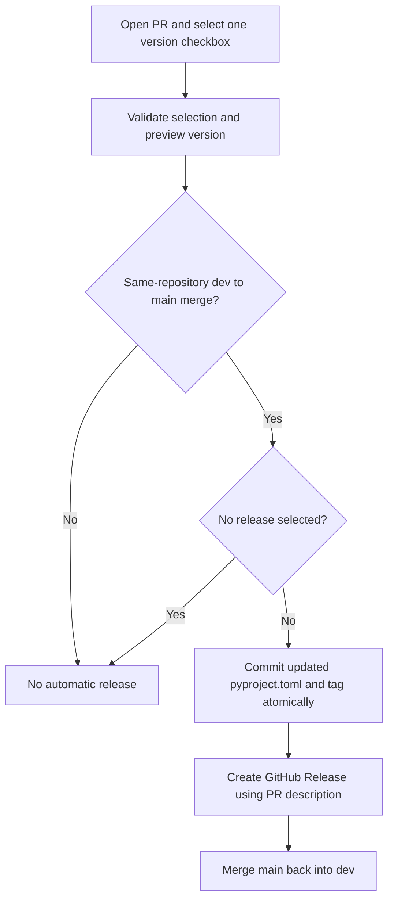

# Pull requests and releases

Open a PR using the supplied template, describe the changes and testing, and
select exactly one version checkbox. Keep the option text unchanged.

| Choice                   | Increment | Example from`0.4.3` |
| ------------------------ | --------- | --------------------- |
| `bugfix / refactoring` | +0.0.1    | `0.4.4`             |
| `minor`                | +0.1.0    | `0.5.0`             |
| `major`                | +1.0.0    | `1.0.0`             |
| `no release`           | None      | `0.4.3`             |

Minor and major increments reset the lower components to zero. Components can
have multiple digits, such as `0.4.10`. Prerelease versions are not supported.
Use major for breaking API/CLI changes, minor for compatible features, and the
combined patch option for fixes and refactoring. Use no release for changes
limited to documentation, tests, or infrastructure.

## Workflow

- Every PR is checked on opening, editing its description, reopening, pushing
  commits, and marking it ready for review. Unchecked or multiple choices fail.
- Leave `pyproject.toml`'s version unchanged in PRs. The check requires it to
  match the target branch. After a release, sync `main` into `dev` before
  opening the next release PR.
- Only a merged PR from this repository's `dev` branch into `main` can release.
  Feature branches, fork branches named `dev`, direct pushes, and unmerged
  closed PRs do not release. Choices on feature PRs are informational; the
  eventual `dev → main` PR chooses the increment for the combined changes.
- A release starts from that PR's exact merged revision, updates
  `pyproject.toml`, and pushes the version commit to `main` together with its
  `vX.Y.Z` tag. The Python package and viewer continue to read the same version
  source. No manual version edit, Versioneer, or `auto` installation is needed.
- The GitHub Release includes the PR title, description, and source link.
  This workflow does not publish packages to PyPI.
- Test instances stay local. The check rejects tracked files under `tests/`;
  workflows no longer delete tests or push cleanup commits to PR branches.

## GitHub setup and recovery

- Merge the template into the default branch before expecting GitHub to
  prefill it for new PRs. Existing PR descriptions must be updated manually.
- Make **Check PR version choice** a required status check in the applicable
  branch rules, and retire the old **Check dev version bump** requirement.
  Require the PR branch to be up to date before merging a release.
- The release job requests `contents: write` from `GITHUB_TOKEN`. Repository
  and organization policies must permit it to push the version commit to
  `main` and create tags/releases. Branch protection may block this; the
  workflow does not bypass it. No additional token is configured.
- Let the release finish before merging another PR into `main`. If `main`
  advances first, the atomic push fails without publishing a partial tag or
  overwriting the newer commits. Integrate the current `main` into `dev` and
  prepare a new release PR after resolving the failure.
- If the tag was pushed but GitHub Release creation failed, rerun the failed
  workflow. It verifies the existing tag's parent and complete file tree
  before using it, and skips creating a release that already exists.
- The automation has local Git integration coverage. Live GitHub execution
  and repository permission settings must be verified on the first release.
